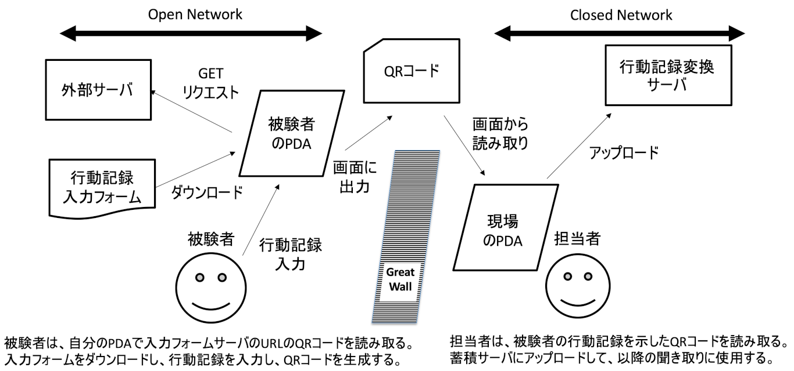

QRcom
=====

Web UIと QRコードを応用したデータの送受信のプロトタイプ

## 背景

この世には制度上の問題で超えたくても超えられない壁、
あるいは超えるのに非常に手間がかかる通信上の壁があります。
この壁は、目の前にあるサーバにテキストデータを
送信することさえも難しくしています。

QRcomを使えば、その壁を超えて比較的安全にデータを送信することが
できる様になるかもしれません。

QRcomはQRコードを使ってデータを送信します。

QRコードは認知度が高いので、
誰でも扱える部類のデータの受け渡し方法と考えられます。
単純なので何かトラブルがあっても使用者は何をすればよいのか分かります。
通信機器の接続に面倒な設定が必要ないので、誰でも使えます。
目の前にあるスマートフォンなどに読み込ませるだけなので、
機器同士を認証する必要がありません。

## 想定している環境



## 送信できるデータ量

QRコードは、QRコード自体の大きさとエラー訂正率(ECC Level)が決まると、
エンコードできるバイト数が決まります。
フラグメントを処理するヘッダに2バイト使っています。

```
Module size   77x77
Dot size      4
ECC Level     L
Capacity      756 (Alphanumeric 758)
```

https://www.qrcode.com/en/about/version.html

## 設定

日本語表示に切り替えられます。
詳しくは qrcom-param.js を見て下さい。

