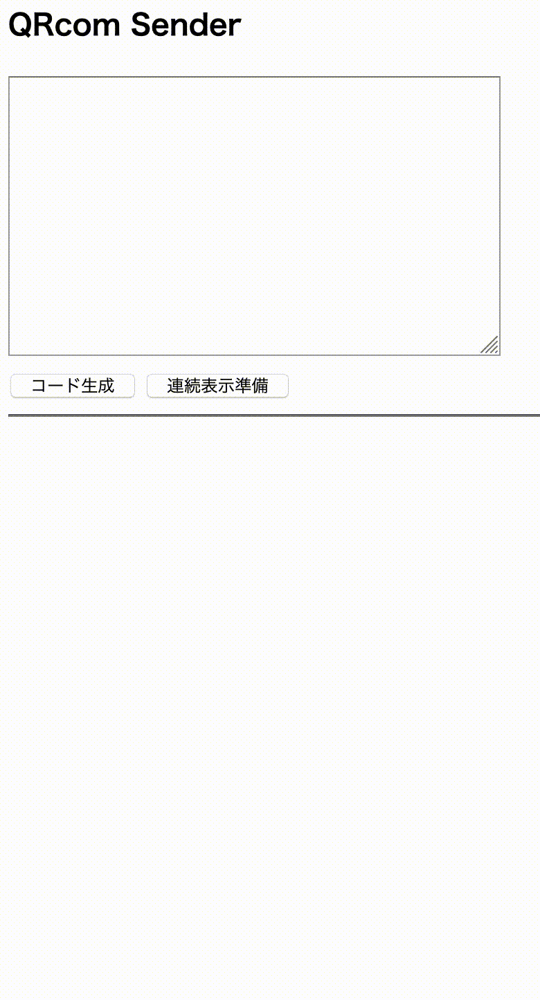
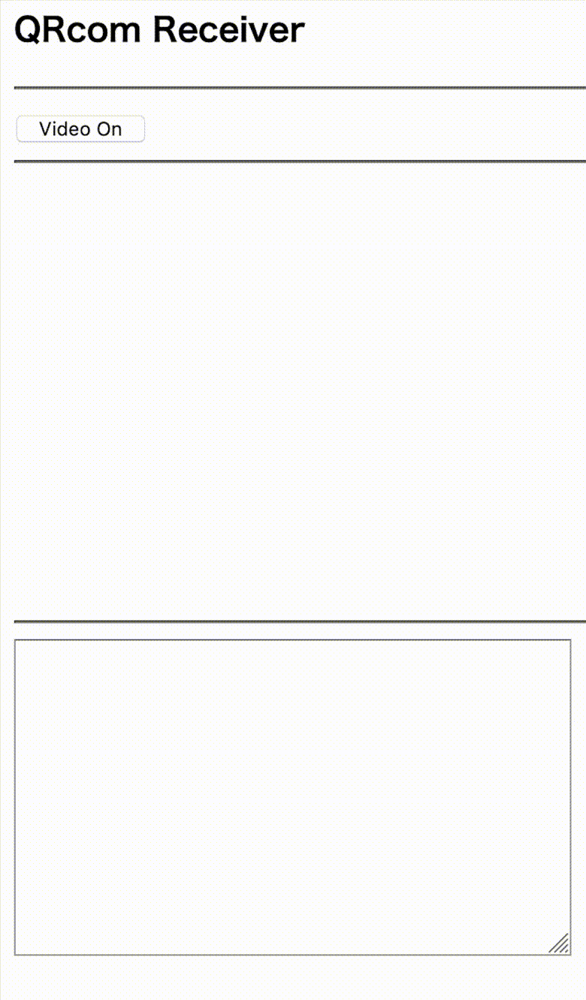

QRCom
=====

data sender and data receiver by QR codes.

## How it works.

Prepare two devices.  One for generating QR codes, another for reading the QR codes.
So, at least the one device needs camera.

You need an HTTPS server, otherwise the data receiver will not work.
Many browsers require a secure connection to get an access right to camera.

Access to s.html from one device,
and put any string including multi-bytes string into the textarea.
Then click 'コード生成'.  It shows the QR codes encoded the string you put.

Access to r.html from another device.
You have to give a permission to access the camera for your browser.
You can read the QR codes on the other device.
Once you have read all codes successfully,
it will decode the set of QR codes,
and you can see the string in the textarea,
which you put on the other device.

For easy to read QR codes, you can click '連続表示準備' once.
Then, you can see a red rectangle around the first QR code.
Forcus on it and hold on, then click '連続表示開始'.
The QR codes will be displayed in order.

## License

MIT License

## Tested Platforms

- MacBook Pro, macOS Version 10.14.6, Chrome Version 87.0.4280.88
- MacBook Pro, macOS Version 10.14.6, Firefox 84.0.1
- Galaxy Feel2 SC-02L, Android 10, Chrome Version 86.0.4240.198
- iPhone 8, iOS 14.2, Safari

## Libraries

- QR code generator
    + qrcode 1.4.4
    + https://github.com/soldair/node-qrcode
    + MIT License

- QR code reader
    + jsQR 1.3.1
    + https://github.com/cozmo/jsQR
    + Apache License

- gzip and gunzip
    + pako 2.0.2
    + https://github.com/nodeca/pako
    + MIT License

